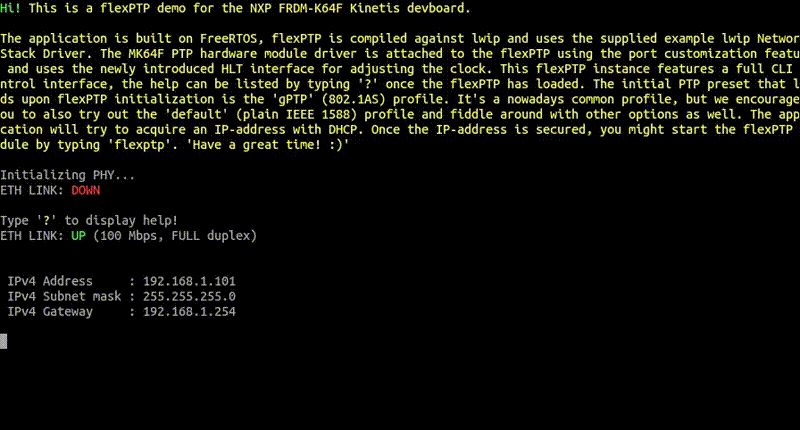

# NXP FRDM-K64F flexPTP demo



## What's this?

> **This is a [flexPTP](https://github.com/epagris/flexPTP) demo project showcasing the capabilities of the flexPTP [IEEE 1588 Precision Time Protocol](https://ieeexplore.ieee.org/document/9120376) implementation for the [NXP FRDM-K64F Kinetis](https://www.nxp.com/design/design-center/development-boards-and-designs/FRDM-K64F) devboard.**

Still not clear what is it useful for? No worries, it's a behind-the-scenes support technology that use unaware every day if you have a smartphone or when you are connected to the internet. Modern telecommunication and measurement systems often rely on precise time synchronization down to the nanoseconds' scale. Methods got standardized by the IEEE and now it's known by the name of the Precision Time Protocol. This software project is an evaluation environment to showcase the capabilities of our IEEE 1588 PTP implementation named `flexPTP` on the STMicroelectronics NXP FRDM-K64F Kinetis board.

> [!TIP]
>**Just want to try the demo and skip compiling? Download one of the precompiled binaries and jump to [Deploying](#deploying)!**


### Get the sources

> [!NOTE]
> To acquire the full source tree after cloning the repo, please fetch the linked *submodules* as well:

```
git clone https://github.com/epagris/flexPTP-demo-FRDM-K64F
cd flexPTP-demo-FRDM-K64F
git submodule init
git submodule update
```

## Building

### Prerequisites

The following two pieces of software are necessary for building:
- `arm-none-eabi-gcc` (v12+): the GCC ARM Cortex-M C cross-compiler
- `cmake` (v3.15+): KitWare's build management system

> [!NOTE]
> Both applications are available on common Linux systems through the official package repository. For building on Windows, install the [ARM GNU toolchain](https://developer.arm.com/downloads/-/arm-gnu-toolchain-downloads) and [CMake](https://cmake.org/).

The project relies on the [NXP MCUXpresso SDK](https://github.com/nxp-mcuxpresso/mcux-sdk). The SDK's root dir must be exported through the `MCUXSDK` environmental variable so that CMake can reference it using `$ENV{MCUXSDK}`. Alternatively, set the path using the `MCUXDSK` variable on the command line during CMake configuration time (`-DMCUXSDK=...`).

### Compiling

The project is fully CMake managed. Configure and invoke the cross-compiler using the commands below:

```
cmake . -B build
cmake --build build --target flexptp-demo --
```
Once the building has concluded the output binaries would be deposited in the `build` directory: `flexptp-demo.elf`, `flexptp-demo.bin`, `flexptp-demo.hex`

## Deploying

### Downloading the firmware

The compiled binaries can be downloaded onto the devboard through several tools:

#### Using the `openocd` tool

The [OpenOCD](https://openocd.org/) programming/debugging tool can also be used to upload the firmware using the following command:

`openocd -f "board/nxp_frdm-k64f.cfg" -c init -c halt -c "program build/flexptp-demo.elf reset exit"`

OpenOCD is also available through the common Linux package managers.

#### Using the MCUXpresso utilities

To download and debug the firmware using the [MCUXpresso VSCode extension](https://marketplace.visualstudio.com/items?itemName=NXPSemiconductors.mcuxpresso) features configure the respective path variables. To learn more, read the [development](#development) section.

### Interacting with the firmware

The firmware prints its messages to and expect user input coming on the board controller's virtual serial port using the `115200-8-N-1` configuration. Use [Putty](https://www.putty.org/) or any equivalent (e.g. GtkTerm) serial port terminal to communicate with the firmware. On Linux, the device will show up as `/dev/ttyACMx`.

> [!NOTE]
> Read the firmware's bootup hints and messages carefully!

### PPS signal and external event timestamping

The 1PPS signal is emitted on the `PTC16` pin (FRDM-K64F: J1, pin 2). The `PTC17` pin (FRDM-K64F: J1, pin 4) is configured to capture and timestamp rising edges on the pin with the PTP clock. Captured timestamps will be printed in the following form: `Capture: 1753433377.203422580`.

## Test environment

To test the software and evaluate the synchronization accuracy connect the devboard with another PTP-compatible equipment, either a dedicated Master clock or any other device (e.g. another devboard). We recommend using the [linuxptp](https://github.com/richardcochran/linuxptp) software suite available in Linux systems through the official package repositories, PTP hardware support is available out-of-the-box on several Intel NICs, like Intel I210, Intel I219-V or Intel 82576.

## Development

An all-around [Visual Studio Code](https://code.visualstudio.com/) project is packaged along the project to enable easy development, debugging and editing. To enable these powerful features, install the [MCUXpresso](https://marketplace.visualstudio.com/items?itemName=NXPSemiconductors.mcuxpresso), [CMakeTools](https://marketplace.visualstudio.com/items?itemName=ms-vscode.cmake-tools), [Cortex-Debug](https://marketplace.visualstudio.com/items?itemName=marus25.cortex-debug), [Embedded Tools](https://marketplace.visualstudio.com/items?itemName=ms-vscode.vscode-embedded-tools) extensions, and the [OpenOCD](https://openocd.org/) tool.
To harness NXP's proprietary fast programming and debugging features set the `toolchainPath` and `path` fields in the `.vscode/mcuxpresso-tools.json` file accordingly. [clangd](https://marketplace.visualstudio.com/items?itemName=llvm-vs-code-extensions.vscode-clangd) and clang-format are highly recommended.

Thas project has predefined *Launch* and *Attach* tasks.

### Software structure

The project is relying on the following large software building blocks:
- the [FreeRTOS](https://www.freertos.org/) embedded operating system (shipped by the MCUXpresso SDK),
- the [CMSIS RTOS V2](https://arm-software.github.io/CMSIS_6/latest/RTOS2/index.html) module as a wrapper for FreeRTOS,
- the [Lightweight IP](https://github.com/lwip-tcpip/lwip) (lwip) Ethernet stack extended with PTP timestamp support (shipped by the MCUXpresso SDK),
- the [embfmt](https://github.com/epagris/embfmt) a printf()-like formatted printer implementation for embedded systems.

The project is organized the following way:

```
ROOT
  Drivers
    eth_custom: a custom Ethernet driver (with PTP timestamp support) based on the `enet_ethernetif_kinetis.c` driver
  Inc: headers for compile-time library configuration
  Modules
    flexPTP and flexPTP_port: our PTP implementation (submodule) and the MK64F platform driver 
    embfmt: a printf()-like formatted printer implementation for embedded systems (submodule)
  Src
    CMSIS-RTOS: ARM CMSIS-RTOS2 related files
    standard_output: MSG() <-> UART redirection

    ethernet_lwip.c/h: Ethernet stack initialization
    cli.c/h CLI-interface implementation
    cmds.c: custom CLI commands
```
> [!NOTE]
> The flexPTP parameters are defined in the [flexptp_options.h](Inc/flexptp_options.h) header.

### Printing and logging

In this project the memory-heavy `printf()` is replaced by the more embedded-optimized `MSG()` function backed by the `embfmt` library. Parameters and format specifiers are fully `printf()` compatible.

### CLI commands

The software offers you with the following multitude, most flexPTP-related of commands:

```
?                                                  Print this help (22/48)
hist                                               Print command history
osinfo                                             Print OS-related information
flexptp                                            Start flexPTP daemon
ptp pps {freq}                                     Set or query PPS signal frequency [Hz]
ptp servo params [Kp Kd]                           Set or query K_p and K_d servo parameters
ptp servo log internals {on|off}                   Enable or disable logging of servo internals
ptp reset                                          Reset PTP subsystem
ptp servo offset [offset_ns]                       Set or query clock offset
ptp log {def|corr|ts|info|locked|bmca} {on|off}    Turn on or off logging
time [ns]                                          Print time
ptp master [[un]prefer] [clockid]                  Master clock settings
ptp info                                           Print PTP info
ptp domain [domain]                                Print or set PTP domain
ptp tuning [tuning]                                Print or set tuning in PPB
ptp transport [{ipv4|802.3}]                       Set or get PTP transport layer
ptp delmech [{e2e|p2p}]                            Set or get PTP delay mechanism
ptp transpec [{def|gPTP}]                          Set or get PTP transportSpecific field (majorSdoId)
ptp profile [preset [<name>]]                      Print or set PTP profile, or list available presets
ptp tlv [preset [name]|unload]                     Print or set TLV-chain, or list available TLV presets
ptp pflags [<flags>]                               Print or set profile flags
ptp period <delreq|sync|ann> [<lp>|matched]        Print or set log. periods
ptp coarse [threshold]                             Print or set coarse correction threshold
ptp priority [<p1> <p2>]                           Print or set clock priority fields
```

> [!TIP]
> The above hint can be listed by typing '?'.

## Related papers and references

[Time Synchronization Extension for the IO-Link Industrial Communication Protocol](https://ieeexplore.ieee.org/document/10747727)

[Distributed Measurement System for Performance Evaluation of Embedded Clock Synchronization Solutions](https://ieeexplore.ieee.org/document/9805958/)

[Portable, PTP-based Clock Synchronization Implementation for Microcontroller-based Systems and its Performance Evaluation](https://ieeexplore.ieee.org/document/9615250)

[Synchronization of Sampling in a Distributed Audio Frequency Range Data Acquisition System Utilizing Microcontrollers](https://ieeexplore.ieee.org/document/9918455/)

[Methods of Peripheral Synchronization in Real-Time Cyber-Physical Systems](https://ieeexplore.ieee.org/document/10178979/)


## License

The project was created by András Wiesner (Epagris) in 2025 and published under the MIT license. Contributions are welcome! :)


